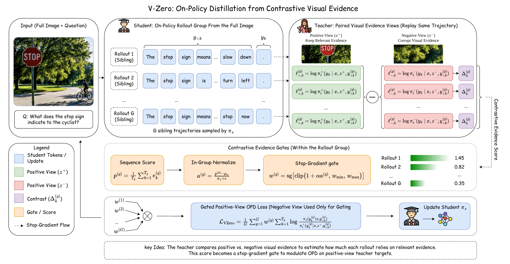

# V-Zero

**V-Zero: Answer-Label-Free On-Policy Distillation with Contrastive Evidence Gating for Fine-Grained Visual Reasoning**

[[Paper]](resource/V-Zero.pdf) [[Model]](https://huggingface.co/hao05/v-zero-4b)

## Overview

V-Zero improves fine-grained visual reasoning without annotated answer labels. The student model samples on-policy reasoning trajectories from the full image, while a teacher model replays the same trajectories with paired positive and negative visual evidence views. By contrasting teacher support under the task-relevant crop and an irrelevant crop, V-Zero estimates how well each trajectory is grounded in visual evidence and uses this signal to gate dense token-level distillation. The resulting training objective keeps standard full-image inference unchanged while providing answer-label-free supervision for localized visual reasoning.

<p align="center">
  
</p>

## Training

The V-Zero training implementation is included under [`verl/`](verl/), with the public launcher in [`scripts/run_vzero_qwen35_vl_fsdp.sh`](scripts/run_vzero_qwen35_vl_fsdp.sh). It configures the on-policy distillation recipe with teacher replay, positive/negative evidence crops, and evidence-gated token distillation.

Install the training package from the repository root:

```bash
uv pip install -e .
```

See [`scripts/README.md`](scripts/README.md) for data schema, environment variables, and launch examples.

## TODO

- [x] Release training code
- [ ] Release data preparation scripts
- [ ] Release evaluation scripts
- [x] Release model checkpoints
- [ ] Add detailed reproduction instructions

## License

This project is released under the Apache License 2.0.
